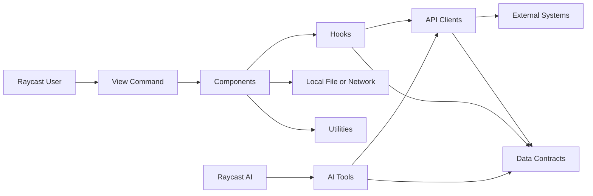
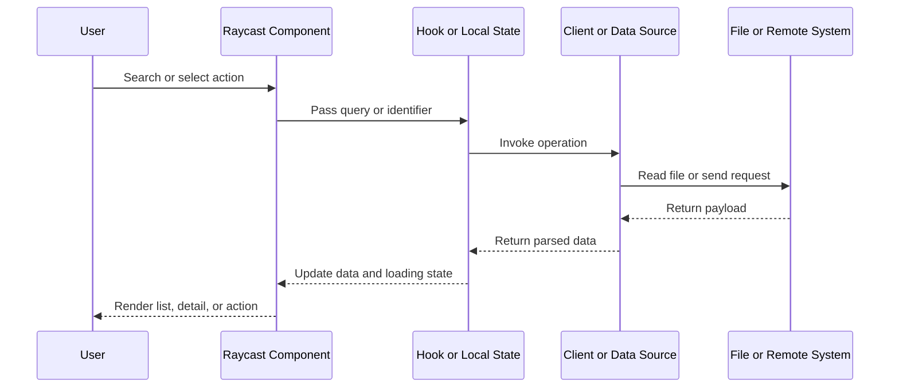

# Architecture

## 1. 系统定位

`shanhh-raycast` 是一个基于 Raycast API, React 和 TypeScript 的个人 Extension 集合. 每个一级目录都是可独立安装和发布的 Extension, 仓库根目录不承担运行时职责.

当前仓库提供 5 类能力:

- `shanhh-totp`: 从本地 JSON 文件生成和复制 TOTP.
- `shanhh-myip`: 查询本地 IP, 国内出口 IP, 全球出口 IP 和 IP 详情.
- `shanhh-nsfw`: 搜索 Btsow 和 JavBus 内容, 详情及磁力链接.
- `shanhh-aitrans`: 通过用户配置的 OpenAI-compatible API 翻译单词, 短语和句子.
- `shanhh-openai-usage`: 查询个人 ChatGPT Codex 套餐用量限制和 Token Analytics.

## 2. 框架入口

每个 `<extension>/package.json` 同时承担 npm package 和 Raycast manifest 的职责.

- `commands` 声明一个名为 `index` 的 View Command.
- `src/index.tsx` 是该 Command 的 React 入口.
- `tools` 声明 Raycast AI 可调用的 Tool. 当前仅 `shanhh-nsfw` 使用.
- `preferences` 声明运行所需的用户配置.
- `ai.yaml` 保存 AI Instructions 和 Evals. 当前仅 `shanhh-nsfw` 使用.

Raycast 通过文件名约定连接 manifest 与代码. Command `index` 对应 `src/index.tsx`, Tool 名称对应 `src/tools/<tool-name>.ts`.

## 3. Extension 与模块关系

仓库的目标依赖方向如下:

1. `index.tsx` 负责 Command 入口和一级功能导航.
2. `components/` 组合 Raycast List, Detail 和 Action.
3. `hooks/` 连接 UI 生命周期与 Client, 负责 loading 和 Toast.
4. `clients/` 负责 Host, Path, HTTP Method, Header, Body 和响应解包.
5. `utils/` 提供 HTML 解析和格式转换.
6. `types/` 描述 Preferences 与外部数据契约.
7. `tools/` 是 AI 输入到 Client 调用的薄适配层.

简单 Extension 不需要凑齐所有层. `shanhh-totp` 通过纯 Utility 解析本地文件和生成 code. `shanhh-myip` 由最小 Client 管理 3 个 Remote Request, Component 只维护页面状态.

## 4. UI 数据流

- TOTP 在 Component 生命周期内读取并验证本地 JSON, 每秒更新倒计时, 每个 30 秒窗口重新生成 code. 可选 `icon` 只解析到内置 PNG asset, 无效值回退 `default.png`.
- My IP Client 并行获取两个公网出口地址, 校验响应并通过 `ipapi.co` 查询详情. Component 同时展示本地地址和独立请求状态.
- NSFW UI 通过 Hook 调用 Btsow 或 JavBus Client, 再使用纯 Parser 转换返回数据. JavBus Client 管理同源 URL 校验和本地图片代理.
- AI Translator 使用 Form 收集原文和 1 至 3 个目标语言. Client 发送 OpenAI Chat Completions 请求并校验结构化结果, 内容解析或结构校验失败时最多重试 3 次, 再由 Detail 将首选译文作为默认复制 Action, 其他语境候选保留在 Actions 中.
- Codex Usage 使用本地状态启动用户配置的 Codex CLI App Server. Client 通过 stdio 协议读取当前登录账号的用量限制, Reset Credits 和 Token Analytics, Component 在 Detail Metadata 展示额度和汇总指标, 在左侧展示 Reset Credit 明细, 并以本地生成的 SVG 双进度条比较周额度剩余与时间剩余, 同时展示按最新 API `startDate` 对齐 UTC 日历的 365 天 Token 用量热力图. 热力图按周列出, 按星期分行, 用 10 级绿色正值强度区分 Token 用量, 明确区分零值和无记录日期, 并展示数据截止日期与图例. 周窗口按时长选择, 时间每分钟本地更新, 额度通过手动刷新更新.

## 5. AI Tool 数据流

AI Tool 不经过 UI Component 和 Hook. `src/tools/<tool-name>.ts` 定义输入类型和 Tool 实现, 完成少量输入规范化后直接调用既有 Client.

JavBus 详情与 magnet Tool 只接受 configured HTTPS origin. AI 查询详情时按 list -> detail 调用, 查询 magnet 时按 list -> detail -> magnet 调用, URL 必须来自前序 Tool 返回值.

`shanhh-nsfw` manifest 当前公开 3 个 Tool:

| Tool | Purpose |
| --- | --- |
| `search-javbus-list` | 搜索 JavBus 列表 |
| `get-javbus-detail` | 获取 JavBus 详情 |
| `search-javbus-magnet-list` | 获取 JavBus 磁力链接 |

## 6. 数据源和配置

| Extension | Data source | Configuration |
| --- | --- | --- |
| `shanhh-totp` | 用户选择的本地 JSON 文件 | `authFile`, 文件内含 TOTP Secret |
| `shanhh-myip` | Local network, `api64.ipify.org`, `myip.ipip.net`, `ipapi.co` | No preferences |
| `shanhh-nsfw` | User-configured Btsow and JavBus hosts | `btsowHost`, `javbusHost` |
| `shanhh-aitrans` | User-configured OpenAI-compatible API | `apiBaseUrl`, `apiKey`, `model`, `targetLanguage1`, `targetLanguage2`, `targetLanguage3` |
| `shanhh-openai-usage` | Local Codex App Server using the current ChatGPT login | `codexBinPath` |

配置由 Raycast Preferences 提供. 本地认证文件只在运行时读取, 不进入仓库.

## 7. 运行时配置

当前 manifest 共声明 10 个 Preference:

- `shanhh-totp`: `authFile`.
- `shanhh-nsfw`: `btsowHost`, `javbusHost`.
- `shanhh-myip`: No preferences.
- `shanhh-aitrans`: `apiBaseUrl`, `apiKey`, `model`, `targetLanguage1`, `targetLanguage2`, `targetLanguage3`.
- `shanhh-openai-usage`: `codexBinPath`.

配置格式和安全要求见 [development.md](./development.md).
