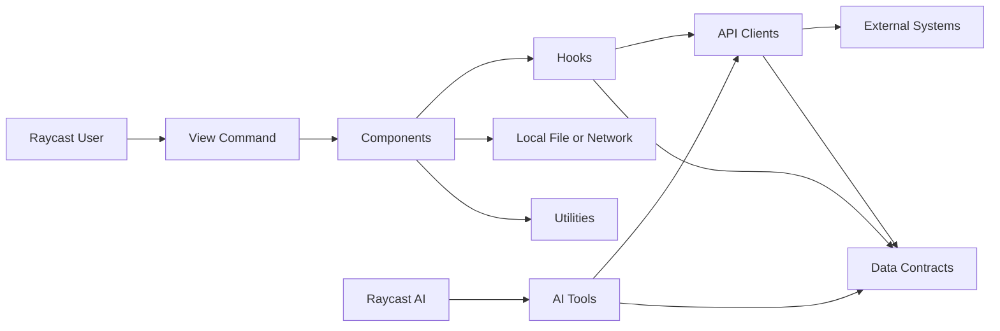
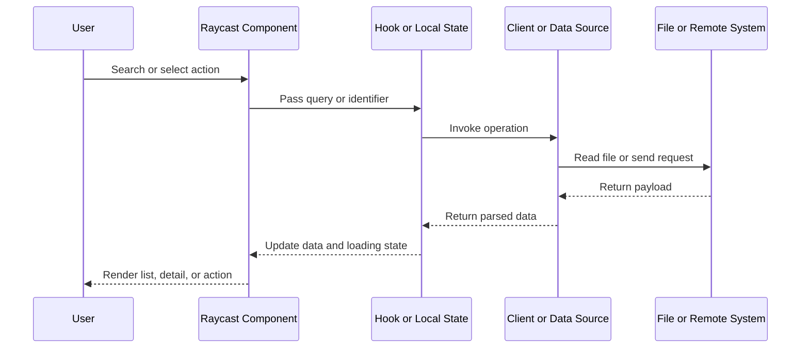

# Architecture

## 1. 系统定位

`shanhh-raycast` 是一个基于 Raycast API, React 和 TypeScript 的个人 Extension 集合. 每个一级目录都是可独立安装和发布的 Extension, 仓库根目录不承担运行时职责.

当前仓库提供 3 类能力:

- `shanhh-totp`: 从本地 JSON 文件生成和复制 TOTP.
- `shanhh-myip`: 查询本地 IP, 国内出口 IP, 全球出口 IP 和 IP 详情.
- `shanhh-nsfw`: 搜索 Btsow 和 JavBus 内容, 详情及磁力链接.

## 2. 框架入口

每个 `<extension>/package.json` 同时承担 npm package 和 Raycast manifest 的职责.

- `commands` 声明一个名为 `index` 的 View Command.
- `src/index.tsx` 是该 Command 的 React 入口.
- `tools` 声明 Raycast AI 可调用的 Tool. 当前仅 `shanhh-nsfw` 使用.
- `preferences` 声明运行所需的用户配置.
- `ai.yaml` 保存 AI Instructions 和 Evals. 当前仅 `shanhh-nsfw` 使用.

Raycast 通过文件名约定连接 manifest 与代码. Command `index` 对应 `src/index.tsx`, Tool 名称对应 `src/tools/<tool-name>.ts`.

## 3. Extension 与模块关系

仓库的目标依赖方向如下:

1. `index.tsx` 负责 Command 入口和一级功能导航.
2. `components/` 组合 Raycast List, Detail 和 Action.
3. `hooks/` 连接 UI 生命周期与 Client, 负责 loading 和 Toast.
4. `clients/` 负责 Host, Path, HTTP Method, Header, Body 和响应解包.
5. `utils/` 提供 HTML 解析和格式转换.
6. `types/` 描述 Preferences 与外部数据契约.
7. `tools/` 是 AI 输入到 Client 调用的薄适配层.

简单 Extension 不需要凑齐所有层. `shanhh-totp` 直接读取本地文件, `shanhh-myip` 当前仍在 Component 中执行请求. 后者是已记录的演进项, 不应成为新增网络功能的模板.

## 4. UI 数据流

- TOTP 在模块加载时读取本地 JSON 文件, 构造 TOTP 条目, UI 负责过滤与 Clipboard 或 Paste Action.
- My IP 并行获取本地地址和两个公网出口地址, 详情页通过 `ipapi.co` 查询补充信息.
- NSFW UI 通过 Hook 调用 Btsow 或 JavBus Client, 再使用 Parser 转换返回数据. JavBus 缩略图可经本地代理重写.

## 5. AI Tool 数据流

AI Tool 不经过 UI Component 和 Hook. `src/tools/<tool-name>.ts` 定义输入类型和 Tool 实现, 完成少量输入规范化后直接调用既有 Client.

`shanhh-nsfw` manifest 当前公开 3 个 Tool:

| Tool | Purpose |
| --- | --- |
| `search-javbus-list` | 搜索 JavBus 列表 |
| `get-javbus-detail` | 获取 JavBus 详情 |
| `search-javbus-magnet-list` | 获取 JavBus 磁力链接 |

## 6. 数据源和配置

| Extension | Data source | Configuration |
| --- | --- | --- |
| `shanhh-totp` | 用户选择的本地 JSON 文件 | `authFile`, 文件内含 TOTP Secret |
| `shanhh-myip` | Local network, `api64.ipify.org`, `myip.ipip.net`, `ipapi.co` | No preferences |
| `shanhh-nsfw` | Btsow API and user-configured JavBus host | `btsowHost`, `javbusHost` |

配置由 Raycast Preferences 提供. 本地认证文件只在运行时读取, 不进入仓库.

## 7. 运行时配置

当前 manifest 共声明 3 个 Preference:

- `shanhh-totp`: `authFile`.
- `shanhh-nsfw`: `btsowHost`, `javbusHost`.
- `shanhh-myip`: No preferences.

配置格式和安全要求见 [development.md](./development.md).
